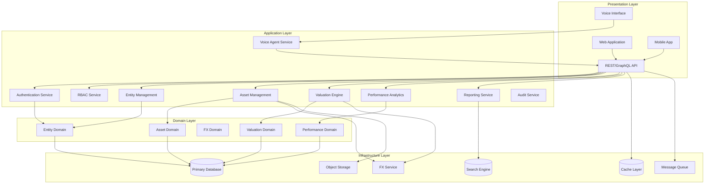
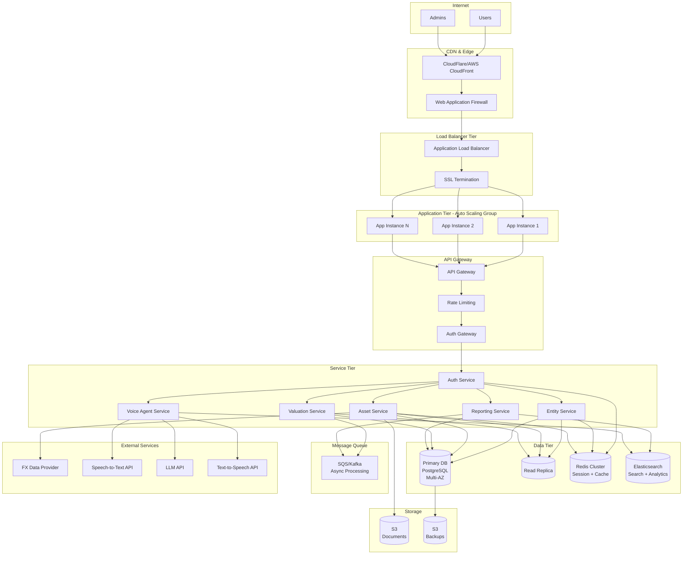
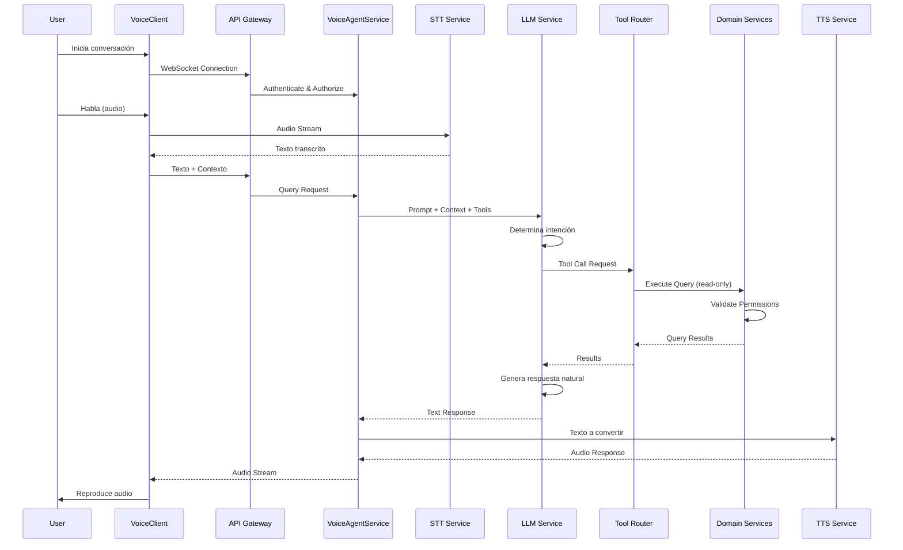
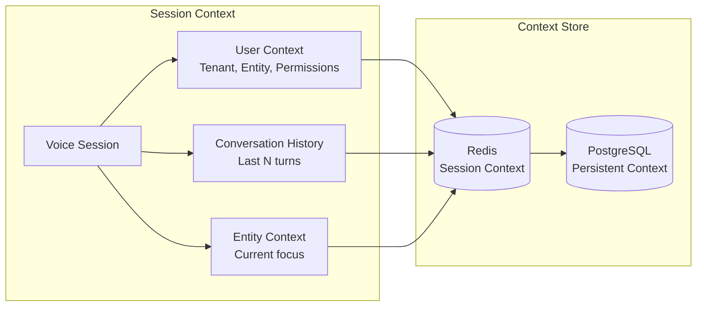
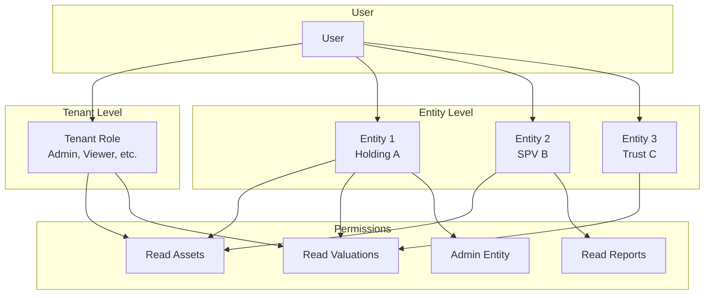
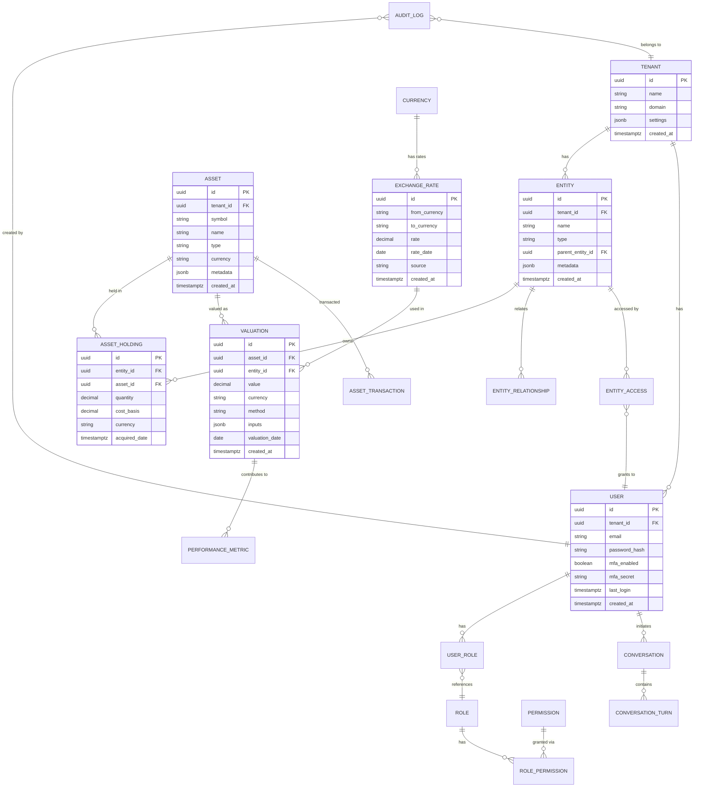

# Arquitectura SaaS Family Office Platform - MVP

## 1. Visión General

### 1.1 Contexto del Negocio

Plataforma SaaS multi-tenant para Family Offices que gestiona:
- Múltiples entidades legales (familias, holdings, SPVs, trusts)
- Activos listados e ilíquidos
- Valuaciones históricas y en tiempo real
- Performance y reporting ejecutivo
- Agente conversacional (texto + voz) para consultas read-only
- Cumplimiento regulatorio y auditoría completa

### 1.2 Principios Arquitectónicos

- **Seguridad First**: RBAC granular, auditoría completa, MFA obligatorio
- **Multi-tenancy Estricto**: Aislamiento de datos por tenant y entidad
- **Escalabilidad Horizontal**: Arquitectura cloud-native, stateless
- **Auditabilidad**: Trazabilidad completa de todas las operaciones
- **Enterprise-Grade**: Alta disponibilidad, disaster recovery, compliance

---

## 2. Arquitectura Lógica

### 2.1 Capas de la Arquitectura



### 2.2 Bounded Contexts (Dominios)

#### 2.2.1 Identity & Access Management (IAM)
**Responsabilidad**: Autenticación, autorización, gestión de usuarios y roles

**Entidades Principales**:
- User
- Role
- Permission
- Tenant
- EntityAccess

**Reglas de Negocio**:
- MFA obligatorio para todos los usuarios
- Roles definidos por tenant y entidad
- Permisos granulares a nivel de entidad
- Sesiones con timeout configurable

#### 2.2.2 Entity Management
**Responsabilidad**: Gestión de entidades legales y su jerarquía

**Entidades Principales**:
- Tenant (Family Office)
- Entity (Family, Holding, SPV, Trust)
- EntityHierarchy
- EntityRelationship

**Reglas de Negocio**:
- Soporte para jerarquías complejas
- Relaciones entre entidades (ownership, control)
- Validación de estructura legal
- Histórico de cambios estructurales

#### 2.2.3 Asset Management
**Responsabilidad**: Gestión de activos listados e ilíquidos

**Entidades Principales**:
- Asset
- ListedAsset
- IlliquidAsset
- AssetHolding
- AssetTransaction
- AssetDocument

**Reglas de Negocio**:
- Soporte multi-moneda nativo
- Valuaciones históricas inmutables
- Tracking de cost basis y realizaciones
- Documentación adjunta por activo

#### 2.2.4 FX & Currency Management
**Responsabilidad**: Gestión de tipos de cambio históricos y actuales

**Entidades Principales**:
- Currency
- ExchangeRate
- FXRateHistory
- CurrencyConversion

**Reglas de Negocio**:
- Tasas históricas inmutables
- Múltiples fuentes de datos (Bloomberg, Reuters, manual)
- Conversiones automáticas en transacciones
- Reporting en múltiples monedas base

#### 2.2.5 Valuation Engine
**Responsabilidad**: Cálculo de valuaciones de activos

**Entidades Principales**:
- Valuation
- ValuationMethod
- ValuationInput
- ValuationSnapshot

**Reglas de Negocio**:
- Valuaciones inmutables (snapshots)
- Múltiples métodos por tipo de activo
- Valuaciones programadas y on-demand
- Histórico completo de valuaciones

#### 2.2.6 Performance Analytics
**Responsabilidad**: Cálculo de métricas de performance

**Entidades Principales**:
- PerformanceMetric
- PerformanceCalculation
- Benchmark
- Attribution

**Reglas de Negocio**:
- Cálculos en tiempo real y batch
- Métricas estándar (IRR, TWR, Sharpe, etc.)
- Comparación con benchmarks
- Attribution analysis

#### 2.2.7 Reporting & Analytics
**Responsabilidad**: Generación de reportes ejecutivos

**Entidades Principales**:
- Report
- ReportTemplate
- ReportSchedule
- Dashboard
- KPI

**Reglas de Negocio**:
- Reportes personalizables por tenant
- Exportación en múltiples formatos
- Scheduling automático
- Dashboards interactivos

#### 2.2.8 Voice Agent
**Responsabilidad**: Agente conversacional read-only

**Entidades Principales**:
- Conversation
- ConversationContext
- VoiceSession
- QueryIntent

**Reglas de Negocio**:
- Solo operaciones read-only
- Contexto mantenido por sesión
- Validación de permisos por query
- Logging completo de interacciones

#### 2.2.9 Audit & Compliance
**Responsabilidad**: Auditoría y cumplimiento

**Entidades Principales**:
- AuditLog
- ComplianceRule
- ComplianceCheck
- DataRetentionPolicy

**Reglas de Negocio**:
- Logging de todas las operaciones
- Retención configurable por tipo de dato
- Compliance checks automáticos
- Reportes de auditoría

---

## 3. Arquitectura Física

### 3.1 Topología de Deployment



### 3.2 Stack Tecnológico

#### 3.2.1 Backend
- **Runtime**: Node.js 20+ (TypeScript) o Python 3.11+ (FastAPI)
- **Framework**: Express.js / FastAPI
- **ORM**: Prisma / SQLAlchemy
- **API**: REST + GraphQL (opcional para MVP)

#### 3.2.2 Base de Datos
- **Primary DB**: PostgreSQL 15+ (multi-AZ, encrypted at rest)
- **Cache**: Redis 7+ (cluster mode)
- **Search**: Elasticsearch 8+ / OpenSearch
- **Time Series**: TimescaleDB (extension de PostgreSQL) para métricas

#### 3.2.3 Infraestructura
- **Cloud Provider**: AWS / Azure / GCP
- **Containerization**: Docker + Kubernetes (EKS/GKE/AKS)
- **Service Mesh**: Istio (opcional para MVP)
- **Message Queue**: AWS SQS / Apache Kafka
- **Object Storage**: S3 / Azure Blob / GCS

#### 3.2.4 Frontend
- **Framework**: React 18+ / Next.js
- **State Management**: Zustand / Redux Toolkit
- **UI Library**: Material-UI / Ant Design
- **Charts**: Recharts / D3.js

#### 3.2.5 Seguridad
- **Auth**: OAuth 2.0 / OIDC (Auth0 / AWS Cognito)
- **MFA**: TOTP (Google Authenticator) + SMS backup
- **Encryption**: TLS 1.3 in-transit, AES-256 at-rest
- **Secrets**: AWS Secrets Manager / HashiCorp Vault

#### 3.2.6 Observabilidad
- **Logging**: ELK Stack / CloudWatch Logs
- **Metrics**: Prometheus + Grafana
- **Tracing**: Jaeger / AWS X-Ray
- **APM**: New Relic / Datadog

---

## 4. Arquitectura del Agente de Voz

### 4.1 Flujo de Conversación



### 4.2 Componentes del Agente

#### 4.2.1 Speech-to-Text (STT)
- **Proveedor**: AWS Transcribe / Google Speech-to-Text / Azure Speech
- **Características**:
  - Streaming para latencia baja
  - Soporte multi-idioma
  - Custom vocabulary (términos financieros)
  - Speaker diarization (opcional)

#### 4.2.2 Intención y Tool Calling
- **LLM**: GPT-4 / Claude 3 / Llama 3 (via API)
- **Funcionalidad**:
  - Análisis de intención del usuario
  - Mapeo a herramientas disponibles (read-only)
  - Construcción de queries parametrizadas
  - Validación de contexto y permisos

#### 4.2.3 Tools Disponibles (Read-Only)
```python
# Ejemplos de tools disponibles para el agente
tools = [
    {
        "name": "get_portfolio_value",
        "description": "Obtiene el valor total del portfolio de una entidad",
        "parameters": {
            "entity_id": "string",
            "currency": "string",
            "as_of_date": "date"
        }
    },
    {
        "name": "get_asset_performance",
        "description": "Obtiene métricas de performance de un activo",
        "parameters": {
            "asset_id": "string",
            "period": "string"
        }
    },
    {
        "name": "search_assets",
        "description": "Busca activos por criterios",
        "parameters": {
            "query": "string",
            "entity_id": "string"
        }
    },
    {
        "name": "get_valuation_history",
        "description": "Obtiene histórico de valuaciones",
        "parameters": {
            "asset_id": "string",
            "start_date": "date",
            "end_date": "date"
        }
    }
]
```

#### 4.2.4 Text-to-Speech (TTS)
- **Proveedor**: AWS Polly / Google Text-to-Speech / Azure TTS
- **Características**:
  - Voz natural y expresiva
  - Streaming de audio
  - Múltiples voces y idiomas
  - SSML para control de pronunciación

### 4.3 Gestión de Contexto



**Estrategia de Contexto**:
- Contexto en memoria (Redis) para sesión activa
- Historial limitado a últimos N turnos (ej: 10)
- Persistencia en DB para auditoría
- Contexto por usuario, tenant y entidad

### 4.4 Seguridad del Agente

- **Autenticación**: Token JWT en WebSocket handshake
- **Autorización**: Validación de permisos por tool call
- **Aislamiento**: Contexto aislado por tenant y entidad
- **Auditoría**: Logging de todas las queries y respuestas
- **Rate Limiting**: Límites por usuario y tenant
- **Content Filtering**: Validación de respuestas del LLM

---

## 5. Seguridad y Aislamiento Multi-Tenant

### 5.1 Estrategia de Aislamiento

#### 5.1.1 Aislamiento de Datos

**Opción Recomendada: Row-Level Security (RLS) + Tenant ID**

```sql
-- Ejemplo de esquema con RLS
CREATE TABLE assets (
    id UUID PRIMARY KEY,
    tenant_id UUID NOT NULL,
    entity_id UUID NOT NULL,
    ...
);

-- Política RLS
CREATE POLICY tenant_isolation ON assets
    FOR ALL
    USING (tenant_id = current_setting('app.current_tenant_id')::UUID);
```

**Ventajas**:
- Un solo schema, fácil mantenimiento
- Aislamiento a nivel de aplicación y DB
- Escalabilidad horizontal
- Costos optimizados

**Desventajas**:
- Requiere disciplina en queries (siempre filtrar por tenant_id)
- Riesgo de data leak si hay bugs

#### 5.1.2 Aislamiento por Schema (Alternativa)

```sql
-- Schema por tenant
CREATE SCHEMA tenant_abc123;
CREATE SCHEMA tenant_def456;
```

**Ventajas**:
- Aislamiento físico completo
- Fácil backup/restore por tenant
- Compliance más simple

**Desventajas**:
- Complejidad operacional alta
- Migraciones complejas
- Costos más altos

**Recomendación MVP**: RLS + Tenant ID (más simple, suficiente para MVP)

### 5.2 RBAC por Entidad



**Modelo de Permisos**:
- Permisos a nivel de tenant (globales)
- Permisos a nivel de entidad (granulares)
- Herencia de permisos (opcional)
- Denegación explícita (override)

### 5.3 Auditoría Completa

**Tabla de Auditoría**:
```sql
CREATE TABLE audit_logs (
    id UUID PRIMARY KEY,
    tenant_id UUID NOT NULL,
    entity_id UUID,
    user_id UUID NOT NULL,
    action VARCHAR(100) NOT NULL,
    resource_type VARCHAR(50) NOT NULL,
    resource_id UUID,
    old_values JSONB,
    new_values JSONB,
    ip_address INET,
    user_agent TEXT,
    timestamp TIMESTAMPTZ NOT NULL DEFAULT NOW(),
    metadata JSONB
);

CREATE INDEX idx_audit_tenant_time ON audit_logs(tenant_id, timestamp);
CREATE INDEX idx_audit_user_time ON audit_logs(user_id, timestamp);
CREATE INDEX idx_audit_resource ON audit_logs(resource_type, resource_id);
```

**Eventos Auditados**:
- Login/Logout
- Creación/Modificación/Eliminación de recursos
- Accesos a datos sensibles
- Cambios de permisos
- Exportaciones de datos
- Queries del agente de voz

### 5.4 MFA (Multi-Factor Authentication)

**Implementación**:
1. **TOTP** (Time-based One-Time Password)
   - Google Authenticator / Authy
   - QR code en registro
   - Backup codes

2. **SMS Backup** (opcional)
   - Para recuperación
   - No como método principal (menos seguro)

3. **Hardware Keys** (Fase 2)
   - WebAuthn / FIDO2
   - YubiKey support

**Flujo**:
```
Login → Username/Password → MFA Challenge → TOTP/SMS → Session Token
```

### 5.5 Encriptación

**In-Transit**:
- TLS 1.3 para todas las conexiones
- Certificate pinning en mobile apps
- HSTS headers

**At-Rest**:
- Database: Encryption at rest (AWS RDS / Azure SQL)
- Object Storage: Server-side encryption (S3 SSE)
- Backups: Encrypted antes de almacenar

**Application-Level**:
- Campos sensibles: Encriptación adicional (ej: PII)
- Secrets: En Secrets Manager / Vault
- API Keys: Hasheados (bcrypt/argon2)

---

## 6. Modelo de Datos Principal

### 6.1 Esquema Core



### 6.2 Índices Críticos

```sql
-- Multi-tenant isolation
CREATE INDEX idx_assets_tenant ON assets(tenant_id);
CREATE INDEX idx_entities_tenant ON entities(tenant_id);
CREATE INDEX idx_users_tenant ON users(tenant_id);

-- Entity relationships
CREATE INDEX idx_entities_parent ON entities(parent_entity_id);
CREATE INDEX idx_entity_relationships ON entity_relationships(entity_id, related_entity_id);

-- Asset queries
CREATE INDEX idx_asset_holdings_entity ON asset_holdings(entity_id);
CREATE INDEX idx_valuations_asset_date ON valuations(asset_id, valuation_date DESC);
CREATE INDEX idx_valuations_entity_date ON valuations(entity_id, valuation_date DESC);

-- FX queries
CREATE INDEX idx_exchange_rates_currencies_date ON exchange_rates(from_currency, to_currency, rate_date DESC);

-- Performance
CREATE INDEX idx_audit_logs_tenant_time ON audit_logs(tenant_id, timestamp DESC);
CREATE INDEX idx_conversations_user_time ON conversations(user_id, created_at DESC);
```

---

## 7. Integraciones Externas

### 7.1 Fuentes de Datos FX

**Proveedores**:
- **Bloomberg API**: Tiempo real + histórico (premium)
- **Reuters/Eikon**: Tiempo real + histórico
- **XE.com API**: Histórico (backup)
- **Manual**: Para correcciones y tasas custom

**Estrategia**:
- Primary: Bloomberg/Reuters (tiempo real)
- Fallback: XE.com (histórico)
- Manual override: Para casos especiales
- Cache: Redis para tasas frecuentes

### 7.2 Datos de Mercado (Listados)

**Proveedores**:
- **Bloomberg**: Precios, corporate actions
- **Yahoo Finance API**: Backup (gratis, limitado)
- **Alpha Vantage**: Alternativa
- **IEX Cloud**: Para US markets

**Estrategia**:
- Primary: Bloomberg (completo)
- Backup: Yahoo Finance / Alpha Vantage
- Cache agresivo: Precios válidos durante trading hours

### 7.3 Servicios de Voz

**STT**:
- **AWS Transcribe**: Streaming, multi-idioma
- **Google Speech-to-Text**: Alternativa
- **Azure Speech**: Alternativa

**LLM**:
- **OpenAI GPT-4**: Primary
- **Anthropic Claude**: Backup
- **Self-hosted Llama**: Para datos sensibles (Fase 2)

**TTS**:
- **AWS Polly**: Natural voices, SSML
- **Google TTS**: Alternativa
- **Azure TTS**: Alternativa

---

## 8. Trade-offs Técnicos

### 8.1 Multi-Tenancy: RLS vs Schema-per-Tenant

| Aspecto | RLS + Tenant ID | Schema-per-Tenant |
|---------|----------------|-------------------|
| **Complejidad** | Baja | Alta |
| **Aislamiento** | Lógico | Físico |
| **Escalabilidad** | Alta | Media |
| **Costos** | Bajos | Altos |
| **Migraciones** | Simples | Complejas |
| **Backup/Restore** | Por tenant (filtrado) | Por schema |
| **Riesgo Data Leak** | Medio (mitigado con RLS) | Bajo |

**Decisión MVP**: RLS + Tenant ID
**Razón**: Simplicidad, escalabilidad, costos. Suficiente para MVP con buenas prácticas.

### 8.2 Base de Datos: Monolítica vs Microservicios

| Aspecto | Monolítica | Microservicios |
|---------|-----------|----------------|
| **Complejidad Operacional** | Baja | Alta |
| **Desarrollo** | Rápido | Más lento |
| **Escalabilidad** | Vertical + Read Replicas | Horizontal por servicio |
| **Consistencia** | ACID fuerte | Eventual (saga pattern) |
| **Deployment** | Simple | Complejo (orchestration) |

**Decisión MVP**: Monolítica modular
**Razón**: MVP necesita velocidad. Modularidad permite migrar a microservicios después.

### 8.3 Cache Strategy: Write-Through vs Write-Back

| Aspecto | Write-Through | Write-Back |
|---------|--------------|------------|
| **Consistencia** | Alta | Eventual |
| **Complejidad** | Baja | Alta |
| **Performance Write** | Más lento | Más rápido |
| **Riesgo Data Loss** | Bajo | Medio |

**Decisión MVP**: Write-Through para datos críticos, Write-Back para analytics
**Razón**: Balance entre consistencia y performance.

### 8.4 Voice Agent: Streaming vs Batch

| Aspecto | Streaming | Batch |
|---------|-----------|-------|
| **Latencia** | Baja (real-time) | Alta |
| **Complejidad** | Alta | Baja |
| **User Experience** | Mejor | Aceptable |
| **Costos** | Más altos | Más bajos |

**Decisión MVP**: Streaming para STT/TTS, batch para LLM processing
**Razón**: UX mejor sin complejidad excesiva.

### 8.5 FX Data: Real-time vs Batch Updates

| Aspecto | Real-time | Batch (Hourly/Daily) |
|---------|-----------|---------------------|
| **Precisión** | Máxima | Suficiente para reporting |
| **Costos** | Altos | Bajos |
| **Complejidad** | Alta | Baja |
| **Use Case** | Trading activo | Family Office reporting |

**Decisión MVP**: Batch updates (hourly) + manual override
**Razón**: Family Offices no necesitan real-time, batch es suficiente y más económico.

---

## 9. Roadmap Técnico

### 9.1 MVP (Fase 1) - 3-4 meses

#### 9.1.1 Core Features
- [x] **Multi-tenant básico**: RLS + Tenant ID
- [x] **Entity Management**: CRUD de entidades, jerarquías simples
- [x] **Asset Management**: Activos listados e ilíquidos básicos
- [x] **FX Management**: Tasas históricas, conversión manual
- [x] **Valuations**: Valuaciones manuales y por precio de mercado
- [x] **Basic Reporting**: Reportes estáticos (PDF/Excel)
- [x] **RBAC básico**: Roles por tenant, permisos por entidad
- [x] **MFA**: TOTP obligatorio
- [x] **Audit Logging**: Logging básico de operaciones críticas

#### 9.1.2 Voice Agent MVP
- [x] **STT básico**: Integración con AWS Transcribe
- [x] **LLM Integration**: GPT-4 con tool calling básico
- [x] **TTS básico**: AWS Polly
- [x] **Tools limitados**: 5-10 queries read-only básicas
- [x] **Contexto simple**: Últimos 5 turnos en memoria
- [x] **Web interface**: Texto + voz básico

#### 9.1.3 Infraestructura MVP
- [x] **Single Region**: AWS us-east-1
- [x] **Database**: PostgreSQL RDS (multi-AZ)
- [x] **Cache**: Redis ElastiCache
- [x] **Storage**: S3 para documentos
- [x] **Deployment**: Docker + ECS (simplificado)
- [x] **Monitoring**: CloudWatch básico
- [x] **Backup**: Automated daily backups

#### 9.1.4 Seguridad MVP
- [x] **Auth**: AWS Cognito / Auth0 básico
- [x] **MFA**: TOTP
- [x] **Encryption**: TLS 1.3, RDS encryption
- [x] **Secrets**: AWS Secrets Manager
- [x] **Audit**: Tabla de audit_logs básica

### 9.2 Fase 2 - 6-8 meses post-MVP

#### 9.2.1 Features Avanzadas
- [ ] **Performance Analytics**: Métricas avanzadas (IRR, TWR, Sharpe)
- [ ] **Attribution Analysis**: Análisis de atribución de performance
- [ ] **Advanced Reporting**: Dashboards interactivos, reportes dinámicos
- [ ] **Scheduled Valuations**: Valuaciones automáticas programadas
- [ ] **Corporate Actions**: Tracking de dividendos, splits, etc.
- [ ] **Tax Reporting**: Reportes fiscales básicos
- [ ] **Document Management**: Gestión avanzada de documentos

#### 9.2.2 Voice Agent Avanzado
- [ ] **Multi-turn Conversations**: Contexto más rico, hasta 20 turnos
- [ ] **Voice Cloning**: Voz personalizada por tenant
- [ ] **Multi-idioma**: Soporte para múltiples idiomas
- [ ] **Advanced Tools**: 20+ herramientas de consulta
- [ ] **Visual Responses**: Gráficos y tablas en respuestas
- [ ] **Proactive Alerts**: Notificaciones proactivas por voz

#### 9.2.3 Infraestructura Avanzada
- [ ] **Multi-Region**: Disaster recovery, baja latencia global
- [ ] **Kubernetes**: Migración a EKS/GKE para mejor orquestación
- [ ] **Service Mesh**: Istio para observabilidad avanzada
- [ ] **CDN Global**: CloudFront para assets estáticos
- [ ] **Advanced Monitoring**: Prometheus + Grafana, distributed tracing
- [ ] **Auto-scaling**: Auto-scaling inteligente basado en métricas

#### 9.2.4 Seguridad Avanzada
- [ ] **Hardware Keys**: WebAuthn / FIDO2 support
- [ ] **Advanced RBAC**: Permisos granulares, herencia, denegaciones
- [ ] **Data Loss Prevention**: DLP para exportaciones
- [ ] **Compliance Automation**: Checks automáticos de compliance
- [ ] **Advanced Audit**: Analytics de auditoría, detección de anomalías
- [ ] **Penetration Testing**: Tests regulares de seguridad

#### 9.2.5 Escalabilidad
- [ ] **Read Replicas**: Múltiples read replicas por región
- [ ] **Database Sharding**: Sharding por tenant (si necesario)
- [ ] **Caching Avanzado**: Cache distribuido, invalidation inteligente
- [ ] **Message Queue**: Kafka para eventos asíncronos
- [ ] **Event Sourcing**: Para auditoría y replay (opcional)

### 9.3 Fase 3 - 12+ meses (Futuro)

- [ ] **AI/ML Avanzado**: Predicciones, recomendaciones, detección de anomalías
- [ ] **Blockchain Integration**: Tracking de activos digitales
- [ ] **API Pública**: API para integraciones de terceros
- [ ] **Marketplace**: Integraciones con otros servicios financieros
- [ ] **Mobile Apps**: Apps nativas iOS/Android
- [ ] **Offline Mode**: Sincronización offline para mobile
- [ ] **White-label**: Versión white-label para partners

---

## 10. Consideraciones de Compliance y Regulatorias

### 10.1 Regulaciones Relevantes

- **GDPR**: Para clientes europeos (derecho al olvido, portabilidad)
- **SOC 2**: Certificación de seguridad (Type II)
- **ISO 27001**: Gestión de seguridad de la información
- **FINRA** (si aplica): Regulaciones financieras US
- **MiFID II** (si aplica): Para clientes europeos en servicios de inversión

### 10.2 Data Retention

**Políticas**:
- **Audit Logs**: 7 años (requisito típico)
- **Financial Data**: Indefinido (requisito regulatorio)
- **User Data**: Hasta eliminación de cuenta + período de gracia
- **Backups**: 30 días rotativos + anuales

### 10.3 Privacy by Design

- **Data Minimization**: Solo datos necesarios
- **Encryption**: End-to-end donde sea posible
- **Access Controls**: Least privilege principle
- **Audit Trails**: Trazabilidad completa
- **Right to Erasure**: Proceso automatizado para GDPR

---

## 11. Métricas y KPIs Técnicos

### 11.1 Performance

- **API Latency**: P95 < 200ms, P99 < 500ms
- **Database Queries**: P95 < 100ms
- **Voice Agent Response**: < 3 segundos end-to-end
- **Report Generation**: < 30 segundos para reportes estándar
- **Page Load Time**: < 2 segundos (web)

### 11.2 Disponibilidad

- **Uptime Target**: 99.9% (MVP), 99.99% (Fase 2)
- **RTO** (Recovery Time Objective): < 4 horas
- **RPO** (Recovery Point Objective): < 1 hora

### 11.3 Escalabilidad

- **Concurrent Users**: 1000+ (MVP), 10000+ (Fase 2)
- **Tenants**: 100+ (MVP), 1000+ (Fase 2)
- **Data Volume**: 1TB+ (MVP), 10TB+ (Fase 2)
- **API Throughput**: 1000 req/s (MVP), 10000 req/s (Fase 2)

### 11.4 Seguridad

- **MFA Adoption**: 100% (obligatorio)
- **Failed Login Attempts**: Alertas después de 3 intentos
- **Audit Coverage**: 100% de operaciones críticas
- **Vulnerability Scans**: Semanales
- **Penetration Tests**: Trimestrales

---

## 12. Riesgos y Mitigaciones

### 12.1 Riesgos Técnicos

| Riesgo | Impacto | Probabilidad | Mitigación |
|--------|---------|--------------|------------|
| **Data Leak entre Tenants** | Crítico | Media | RLS estricto, tests automatizados, code reviews |
| **Performance Degradation** | Alto | Media | Monitoring proactivo, auto-scaling, load testing |
| **Voice Agent Hallucinations** | Medio | Alta | Prompt engineering, validation de respuestas, human review |
| **FX Data Outages** | Medio | Baja | Múltiples proveedores, cache agresivo, fallback manual |
| **Database Corruption** | Crítico | Baja | Backups automatizados, multi-AZ, point-in-time recovery |

### 12.2 Riesgos de Negocio

| Riesgo | Impacto | Probabilidad | Mitigación |
|--------|---------|--------------|------------|
| **Compliance Violations** | Crítico | Baja | Consultoría legal, auditorías regulares, DLP |
| **Security Breach** | Crítico | Baja | Security best practices, penetration testing, insurance |
| **Vendor Lock-in** | Medio | Media | Abstracciones, multi-cloud readiness, estándares abiertos |

---

## 13. Conclusión

Esta arquitectura proporciona una base sólida para el MVP de la plataforma SaaS Family Office, con:

✅ **Multi-tenancy seguro** con RLS y aislamiento estricto
✅ **Escalabilidad horizontal** desde el día uno
✅ **Agente de voz** funcional con read-only operations
✅ **Seguridad enterprise-grade** con MFA, auditoría y encriptación
✅ **Roadmap claro** de MVP a producción enterprise

**Próximos Pasos**:
1. Validar arquitectura con stakeholders
2. Crear POC del agente de voz
3. Setup de infraestructura base (IaC)
4. Desarrollo iterativo siguiendo roadmap

---

**Documento creado por**: Principal Software Architect  
**Fecha**: 2024  
**Versión**: 1.0
